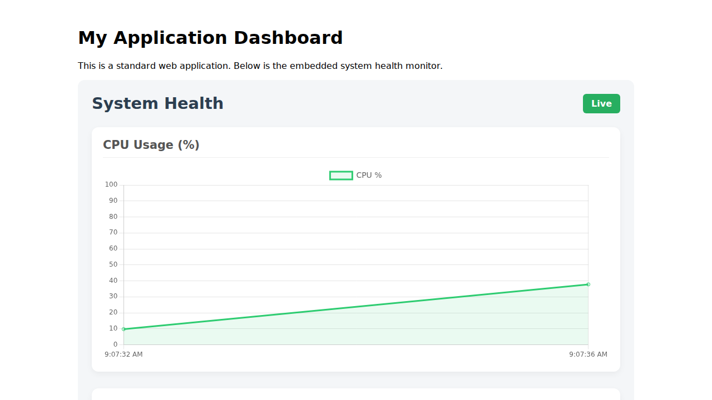

# System Health Monitor 🏥

A lightweight, framework-agnostic Node.js package to monitor server system health (CPU, Memory, Disk, Network) and display it in your frontend application.



## 🚀 Features

*   **Cross-Platform:** Works on **Windows**, **Linux**, and **macOS**.
*   **Deep Metrics:** Uses native OS commands (`wmic`, `top`, `df`) for accurate data.
*   **Framework Agnostic:** Frontend component is pure Vanilla JS — works with **React**, **Angular**, **Vue**, or plain HTML.
*   **Zero Dependencies (Runtime):** Lightweight backend; Frontend dynamically loads Chart.js from CDN (if not present).
*   **Real-time:** Live updates with configurable polling intervals.

## 📦 Installation

```bash
npm install @srikarp/system-health-monitor
```

## 🛠️ Integration Guide

This package consists of two parts:
1.  **Backend:** Collects system metrics.
2.  **Frontend:** Visualizes the metrics.

### 1. Backend Setup (Node.js)

You need to expose an endpoint that your frontend will poll. Here is an example using **Express**:

```javascript
const express = require('express');
const monitor = require('@srikarp/system-health-monitor');

const app = express();

// Start the monitor (begins data collection)
monitor.start();

// Expose the metrics endpoint
app.get('/_system-health', (req, res) => {
    res.json({
        data: monitor.getCurrentHealth().data,
        history: monitor.getHealthHistory(50)
    });
});

app.listen(3000, () => console.log('Server running on port 3000'));
```

### 2. Frontend Setup

In your HTML or Frontend Framework, create a container element and initialize the monitor.

#### Plain HTML / EJS

```html
<!-- 1. Create a Container -->
<div id="health-dashboard"></div>

<!-- 2. Import the Client Script -->
<!-- You can serve this file from node_modules or copy it to your public assets -->
<script src="/path/to/node_modules/@srikarp/system-health-monitor/client/system-health-client.js"></script>

<!-- 3. Initialize -->
<script>
    window.addEventListener('load', () => {
        SystemHealthClient.initMonitor('health-dashboard', {
            apiEndpoint: '/_system-health', // Must match your backend route
            refreshInterval: 2000           // Update every 2 seconds
        });
    });
</script>
```

#### React Example

```jsx
import React, { useEffect } from 'react';
// Note: You might need to copy the client JS to your public folder
// or import it if your bundler supports it.
import SystemHealthClient from '@srikarp/system-health-monitor/client/system-health-client';

const Dashboard = () => {
  useEffect(() => {
    SystemHealthClient.initMonitor('my-dashboard', {
        apiEndpoint: 'http://localhost:3000/_system-health'
    });

    // Cleanup on unmount
    return () => SystemHealthClient.stop();
  }, []);

  return <div id="my-dashboard"></div>;
};

export default Dashboard;
```

## ⚙️ Configuration

### `monitor.start(intervalMs)`
*   `intervalMs` (number): How often the backend collects metrics in milliseconds. Default: `4000`.

### `SystemHealthClient.initMonitor(containerId, options)`
*   `containerId` (string): The ID of the DOM element to render the dashboard into.
*   `options` (object):
    *   `apiEndpoint` (string): The URL of your backend metrics endpoint. Default: `/_system-health`.
    *   `refreshInterval` (number): Polling frequency in ms. Default: `2000`.
    *   `chartColors` (object): Custom hex colors for charts.
        *   `cpu`: Default `#2ecc71` (Green)
        *   `memory`: Default `#3498db` (Blue)

## 📊 Metrics Collected

The package attempts to collect the following data using OS-specific commands:

| Metric | Windows | Linux | macOS |
| :--- | :--- | :--- | :--- |
| **CPU Usage** | `wmic cpu get loadpercentage` | `top` / Node Fallback | Node Fallback |
| **Memory** | `wmic OS` | `free -m` | Node Fallback |
| **Disk Usage** | `wmic logicaldisk` | `df -k` | `df -h` |
| **Processes** | Node API | Node API | Node API |
| **Network** | Node API | Node API | Node API |
| **GPU Info** | `wmic path win32_videocontroller` | `lspci` | `system_profiler` |

*Note: If a native command fails or is unavailable, the package falls back to standard Node.js `os` module metrics to ensure stability.*

## 📄 License

ISC
